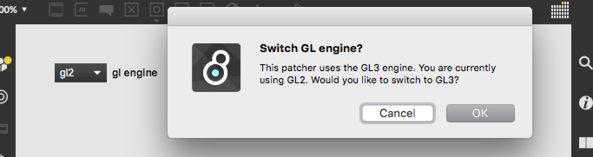

# gl.check

A small abstraction that checks which GL engine is currently used when opening a patcher in MaxJitter (gl2/gl3) and prompts with the question to switch to the other engine if necessary.


## Support my projects

**Consider to [name a fair price](http://gumroad.com/tmhglnd)**

**or [become a patron](http://patreon.com/timohoogland)**

# Reference

**arguments:**

- {Symbol} -> engine to check for and ask to switch to if not currently in use (gl2/gl3, default=gl3)

**bpatch:**

- Transform patcher to bpatcher shows a `[umenu]` object that can be used as an interface to switch engines

### Using as object with GL2/GL3 in a patcher


### Using as a bpatcher



## Install

```
1. download zip
2. unzip and place in Max Library (on MacOS ~/Documents/Max 8/Library)
3. restart Max8
```

```
1. open terminal
2. $ cd ~/Documents/Max\ 8/Library
3. $ git clone https://github.com/tmhglnd/gl.check.git
4. restart Max8
```

# License

MIT License

This program is distributed in the hope that it will be useful,
but WITHOUT ANY WARRANTY; without even the implied warranty of
MERCHANTABILITY or FITNESS FOR A PARTICULAR PURPOSE. See the
GNU General Public License for more details.